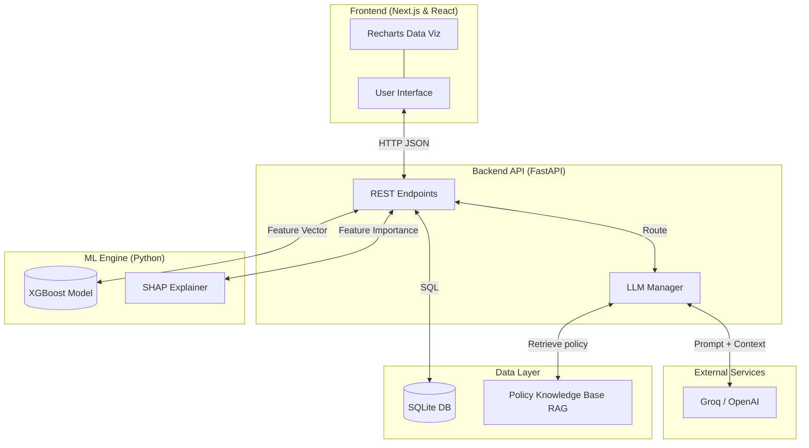

# Credit Risk Scorer

An end-to-end credit-default scoring system: a tuned XGBoost model predicts a
loan applicant's probability of serious delinquency, SHAP explains **why**, and
an AI advisor (grounded in the model, SHAP, and a bank-policy knowledge base)
answers an applicant's real questions — *"why am I high risk?"*, *"how do I
improve?"*, *"would I qualify?"* — like a banker would.

> **Problem.** Lenders (and the people they assess) need a default-risk decision
> that is not a black box — one that explains *why* an applicant is risky and
> *how* they could improve, which matters for trust, fairness, and regulatory
> adverse-action requirements.
>
> **Data.** Kaggle's *Give Me Some Credit* — **150,000** borrowers, 10 numeric
> features + a binary target (`SeriousDlqin2yrs`). It is **heavily imbalanced
> (~6.7% defaults)** and has **missing values** (`MonthlyIncome` ~20%,
> `NumberOfDependents` ~3%); modality is **tabular/structured**.
>
> **Approach.** Compared Logistic Regression, Random Forest, and XGBoost under
> stratified CV; handled imbalance with `scale_pos_weight` (and SMOTE in
> model-selection CV) and tuned XGBoost with **Optuna**. XGBoost won on ROC-AUC,
> so the final artifact is a scikit-learn `Pipeline` (`StandardScaler` → XGBoost)
> with **SHAP** for per-decision explanations and **Fairlearn** for an age-band
> fairness audit.
>
> **Result.** Tuned XGBoost reaches **≈ 0.86 ROC-AUC** on the held-out test set —
> the typical, strong result for this dataset (Kaggle's private-leaderboard top is
> ~0.869). *Your exact value is printed by `python src/train.py` as
> `Test ROC-AUC: …`.*

---

## Features

- **Risk scoring** — default probability + LOW/MEDIUM/HIGH band for any applicant.
- **Explainability** — SHAP factor contributions show exactly which inputs drove
  the score, translated into plain English by the advisor.
- **What-if scenarios** — compare profiles side by side; see how changes move risk.
- **Improvement engine** — tests realistic changes and reports the actions that
  most reduce risk, including the **combined** payoff of doing the top fixes together.
- **AI Credit Advisor** — chat that answers risk, improvement, eligibility,
  documentation, hardship, and fair-lending questions. It is **grounded** (calls
  the real model + SHAP, and retrieves bank policy via RAG), has **conversation
  memory**, and offers a **free tier** (Groq) and a **bring-your-own-key pro tier**.
- **Portfolio dashboard, batch scoring, and PDF reports.**

---

## Architecture

The system is fully decoupled across several layers:



- **Frontend (Presentation Layer):** A highly interactive React SPA (Next.js +
  Tailwind). Communicates with the backend purely over REST, rendering dynamic
  charts and a glassmorphic UI.
- **Backend (API Layer):** An async Python server (FastAPI). Loads the pre-trained
  XGBoost pipeline (`models/xgb_pipeline.pkl`) into memory and serves inference,
  scenarios, batch, dashboard, advisor, and report endpoints.
- **Data Layer:** SQLite stores prediction history and advisor conversation logs
  (giving the advisor **memory** across turns). A retrieval-augmented **policy
  knowledge base** (markdown in `knowledge/`, indexed with TF-IDF) lets the advisor
  ground answers in the bank's lending policy, eligibility thresholds, products,
  hardship programs, and fair-lending rules.
- **ML Engine:** Standard scaling + imputation feed the tuned XGBoost classifier;
  SHAP TreeExplainer produces the local explanations behind every decision.
- **AI Advisor:** The backend orchestrates the LLM (Groq free tier, or the user's
  OpenAI key), injects the applicant's profile + SHAP values, calls model-backed
  tools (risk scoring, improvement projections), and retrieves relevant policy to
  generate grounded, natural-language advice.

---

## Dataset

[Kaggle – Give Me Some Credit](https://www.kaggle.com/datasets/brycecf/give-me-some-credit-dataset)

- **Size:** 150,000 rows; 10 features + target.
- **Target:** `SeriousDlqin2yrs` — serious delinquency within 2 years.
- **Imbalance:** ~6.7% positive (default) — handled with `scale_pos_weight` / SMOTE.
- **Missing:** `MonthlyIncome` (~20%), `NumberOfDependents` (~3%) — imputed.
- **Modality:** tabular / structured numeric.

Place **`cs-training.csv`** in `data/` (gitignored; do not commit).

---

## Run locally

### 1. Backend (FastAPI)

```bash
python -m venv venv
venv\Scripts\activate            # Windows  (use: source venv/bin/activate on macOS/Linux)
pip install -r backend/requirements.txt
```

Create a **`.env`** file in the repo root (copy from `.env.example`) so the
advisor's free tier works:

```
GROQ_API_KEY=gsk_your_key_here    # free key from https://console.groq.com/keys
```

Start the API (it auto-loads `.env`):

```bash
uvicorn backend.main:app --reload --host 0.0.0.0 --port 8000
# Windows shortcut: .\start_backend.ps1
```

### 2. Frontend (Next.js)

```bash
cd frontend
cp .env.example .env.local        # optional; defaults to http://127.0.0.1:8000
npm install
npm run dev
```

Open **http://localhost:3000**.

### 3. (Optional) Retrain from scratch

With `data/cs-training.csv` in place:

```bash
python src/preprocess.py
python src/feature_engineering.py
python src/model_selection.py
python src/train.py          # prints: Test ROC-AUC: 0.86xx
python src/evaluate.py
python src/fairness.py
```

### Tests

```bash
pytest tests/ -v
```

---

## Using the AI Advisor

The advisor has two tiers (selectable in the UI):

| Tier | Provider | Key | Cost to user |
|------|----------|-----|--------------|
| **Free** | Groq (Llama 3.3 70B) | App owner's `GROQ_API_KEY` (server `.env`) | Free |
| **Pro** | OpenAI (GPT-4o / GPT-4.1) | The user pastes their **own** key | Pay-per-use to OpenAI |

A Pro-tier key is sent only for that request, forwarded straight to the provider,
**never written to disk, logged, or stored** — error messages scrub it as `***`.

Ask things like: *"Why is this applicant high risk?"*, *"How can they improve —
show the combined impact"*, *"Would they qualify, per policy?"*, *"What documents
are needed?"*, *"If declined, what adverse-action reasons apply?"*

---

## Model card

| Item | Detail |
|------|--------|
| **Algorithm** | XGBoost inside a sklearn `Pipeline` with `StandardScaler` |
| **Training data** | Give Me Some Credit (cleaned); stratified 80/20 split |
| **Primary metric** | ROC-AUC (≈ 0.86 on test; imbalance via `scale_pos_weight` + SMOTE in CV) |
| **Explainability** | SHAP TreeExplainer — global bar + beeswarm, per-sample waterfall plots |
| **Fairness** | Fairlearn `MetricFrame` by age band (18–30, 31–45, 46–60, 60+); see `data/fairness_report.csv` |
| **AI grounding** | TF-IDF RAG over `knowledge/*.md` (lending policy, products, documentation, hardship, fair lending) |
| **Limitations** | Educational/portfolio project — not for real lending decisions; public dataset has no PII |
| **Monitoring** | `src/monitor.py` logs predictions and flags mean drift vs training |

---

## Project layout

- `src/preprocess.py` – cleaning
- `src/feature_engineering.py` – 6 engineered features, splits, scaler reference
- `src/model_selection.py` – LR / RF / XGB CV (+ optional MLflow)
- `src/train.py` – Optuna-tuned XGBoost pipeline → `models/xgb_pipeline.pkl`
- `src/evaluate.py` – ROC/PR/confusion/threshold + SHAP PNGs
- `src/fairness.py` – Fairlearn age-band audit
- `src/inference.py` – single-row inference + SHAP helpers
- `src/agent.py` – AI advisor: tools, prompts, multi-provider sessions
- `src/knowledge.py` – policy RAG retriever (TF-IDF over `knowledge/`)
- `src/database.py` – SQLite (prediction history + advisor memory)
- `backend/main.py` – FastAPI backend API
- `frontend/` – Next.js React UI
- `knowledge/` – bank-policy documents for the advisor's RAG

---

## License / data

Training data is subject to Kaggle competition terms. This repo is a
learning / portfolio project and is **not** intended for real lending decisions.
