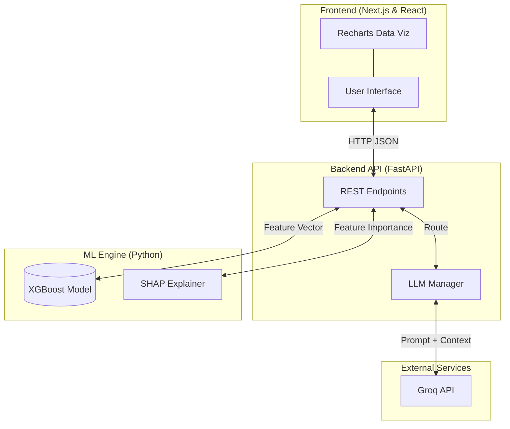

# Credit Risk Scorer

End-to-end classical ML system: loan default probability (Give Me Some Credit), SHAP explanations, Fairlearn age-group audit, **Streamlit** or **Next.js + FastAPI** UI. Deploy on **[Railway](docs/railway.md)** (recommended) or any host that can run Python and Node.

## Tech stack

- **Data:** pandas, NumPy  
- **ML:** scikit-learn, XGBoost, imbalanced-learn (SMOTE), Optuna  
- **Explainability / fairness:** SHAP, Fairlearn  
- **Tracking (optional):** MLflow (`requirements-mlflow.txt`)  
- **App:** **Next.js** (`frontend/`) + **FastAPI** (`backend/`)  
- **Deploy:** Localhost (or deploy backend and frontend independently)

## Architecture

The system is fully decoupled into three distinct layers:



- **Frontend (Presentation Layer):** A modern, highly interactive React Single Page Application built with Next.js and Tailwind CSS. It communicates exclusively via REST to the backend, rendering dynamic charts and a glassmorphic UI.
- **Backend (API Layer):** A fast, async Python server (FastAPI). It loads the pre-trained XGBoost pipeline (`models/xgb_pipeline.pkl`) into memory and handles inference requests.
- **ML Engine (Core Logic):** Processes raw inputs through standard scaling, one-hot encoding, and missing value imputation before passing them to the tuned XGBoost classifier. It also calculates local SHAP values to explain exactly *why* a decision was made.
- **External AI Advisor:** The backend proxy orchestrates requests to external LLM providers (like Groq ), injecting the applicant's risk profile and SHAP values into a structured prompt to generate personalized, natural language financial advice.

## Dataset

[Kaggle – Give Me Some Credit](https://www.kaggle.com/datasets/brycecf/give-me-some-credit-dataset)  
Place **`cs-training.csv`** in `data/` (do not commit; it is gitignored).

## Run locally

1. Create a virtual environment (Python 3.10–3.12 recommended for smoothest installs):

   ```bash
   python -m venv venv
   venv\Scripts\activate
   ```

2. Install dependencies:

   ```bash
   pip install -r requirements.txt
   pip install -r requirements-mlflow.txt
   ```

   On some Windows setups, run `pip install setuptools wheel` before MLflow if `pyarrow` fails to build.

3. Put `data/cs-training.csv` in place, then run the pipeline in order:

   ```bash
   python notebooks/01_eda.py
   python src/preprocess.py
   python src/feature_engineering.py
   python src/model_selection.py
   python src/train.py
   python src/evaluate.py
   python src/fairness.py
   ```

4. Launch the application:

   The application uses a decoupled architecture (FastAPI backend + Next.js frontend).

   **Terminal 1 (Backend):**
   Open a PowerShell terminal in the root project directory and run:
   ```powershell
   # First time only (if Windows blocks the script):
   Set-ExecutionPolicy -ExecutionPolicy RemoteSigned -Scope CurrentUser
   
   # Start the backend server
   .\start_backend.ps1
   ```
   This will start the API on `http://localhost:8000`.

   **Terminal 2 (Frontend):**
   Open a **new** PowerShell terminal tab, then run:
   ```powershell
   # First time only (if Windows blocks npm scripts):
   Set-ExecutionPolicy -ExecutionPolicy RemoteSigned -Scope CurrentUser

   cd frontend
   npm install
   npm run dev
   ```
   Once it starts, open `http://localhost:3000` in your browser.

5. Tests:

   ```bash
   pytest tests/ -v
   ```

## Model card

| Item | Detail |
|------|--------|
| **Algorithm** | XGBoost inside a sklearn `Pipeline` with `StandardScaler` |
| **Training data** | Give Me Some Credit (cleaned); stratified 80/20 split |
| **Primary metric** | ROC-AUC (class imbalance handled with `scale_pos_weight`; SMOTE in model-selection CV) |
| **Explainability** | SHAP TreeExplainer — global bar + beeswarm plots, per-sample waterfall plots (saved as `shap_force_*.png`; SHAP waterfall is the matplotlib-native equivalent of force plots) |
| **Fairness** | Fairlearn `MetricFrame` by age band (18–30, 31–45, 46–60, 60+); see `data/fairness_report.csv` |
| **Limitations** | Synthetic demo scores if trained on small samples; not for real lending; no PII in public dataset |
| **Monitoring** | `src/monitor.py` logs predictions to `data/prediction_log.csv` and flags mean drift vs training |

## Project layout

- `src/preprocess.py` – cleaning  
- `src/feature_engineering.py` – 6 engineered features, splits, scaler reference  
- `src/model_selection.py` – LR / RF / XGB CV + optional MLflow  
- `src/train.py` – Optuna-tuned XGBoost pipeline saved to `models/xgb_pipeline.pkl`  
- `src/evaluate.py` – ROC/PR/confusion/threshold + SHAP PNGs under `data/plots/`  
- `src/fairness.py` – fairness CSV  
- `src/monitor.py` – prediction log + drift helpers  
- `src/inference.py` – single-row inference helpers
- `backend/main.py` – FastAPI backend API
- `frontend/` – Next.js React user interface  

## License / data

Training data is subject to Kaggle competition terms. This repo is a learning/portfolio project.
